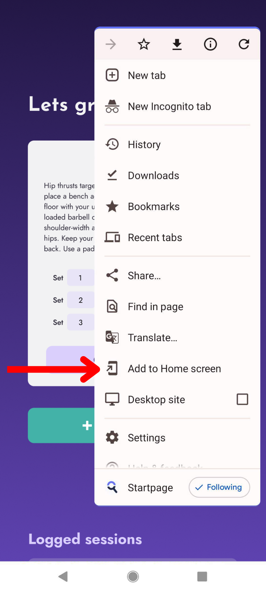

<!-- PROJECT SHIELDS -->
<!-- [![Contributors][contributors-shield]][contributors-url]
[![Forks][forks-shield]][forks-url]
[![Stargazers][stars-shield]][stars-url]
[![Issues][issues-shield]][issues-url]
[![MIT License][license-shield]][license-url] -->

<!-- PROJECT LOGO -->
 

  

<h3 align="center">TrackMyWorkouts: Workout Tracking App</h3>

  

    A front-end fitness app that allows users to track workouts, manage workout sessions, and log progress.
     
     
    <a href="https://github.com/braingel/track-my-workouts/issues/new?labels=bug&template=bug-report---.md">Report Bug</a>
    ·
    <a href="https://github.com/braingel/track-my-workouts/issues/new?labels=enhancement&template=feature-request---.md">Request Feature</a>
  

<!-- TABLE OF CONTENTS -->

  
Table of Contents

  <ol>
    <li>
      <a href="#about-the-project">About The Project</a>
      <ul>
        <li><a href="#built-with">Built With</a></li>
      </ul>
    </li>
    <li>
      <a href="#getting-started">Getting Started</a>
      <ul>
        <li><a href="#prerequisites">Prerequisites</a></li>
        <li><a href="#installation">Installation</a></li>
      </ul>
    </li>
    <li><a href="#usage">Usage</a></li>
    <li><a href="#roadmap">Roadmap</a></li>
    <li><a href="#contributing">Contributing</a></li>
    <li><a href="#license">License</a></li>
    <li><a href="#contact">Contact</a></li>
  </ol>

<!-- ABOUT THE PROJECT -->
## About The Project
[![Product Mockup][product-screenshot]][TrackMyWorkout]

This project provides a simple interface to log and manage your workout routines. It uses JavaScript to store data in the browser’s local storage for offline access, manipulates DOM elements, and manages classes for enhanced interactivity. Firebase Realtime Database securely stores workout data, syncing with local storage for efficient retrieval. With this app you can:
  - Add new workouts with multiple sets
  - Edit existing workouts
  - Delete workouts
  - Log completed sessions with timestamp
  - View logged workout sessions

(<a href="#readme-top">back to top</a>)

### Built With

* [![HTML5]][HTML5-url]
* [![CSS3]][CSS3-url]
* [![Javascript]][Javascript-url]
* [![Firebase]][Firebase-url]

(<a href="#readme-top">back to top</a>)

<!-- GETTING STARTED -->
## Getting Started

### Prerequisites

No prerequistes are required to run this project.

### Installation
To use TrackMyWorkouts, you can access the live version hosted on Netlify:

[TrackMyWorkouts Live][TrackMyWorkout]

### Adding to Mobile Homescreen

To use TrackMyWorkouts efficiently on mobile devices:

#### Safari (iOS)

1. Open Safari and navigate to [TrackMyWorkouts Live][TrackMyWorkout].
2. Tap the "Share" button at the bottom center.
3. Scroll down and tap on "Add to Home Screen".
4. Enter a name for the shortcut and tap "Add".

 

#### Chrome (Android)

1. Open Chrome and navigate to [TrackMyWorkouts Live][TrackMyWorkout].
2. Tap the menu button (three dots) at the top right.
3. Select "Add to Home screen".
4. Enter a name for the shortcut and tap "Add".

 

(<a href="#readme-top">back to top</a>)

<!-- USAGE EXAMPLES -->
## Usage

Once installed:

1. **Log in or Enter Name**: When first accessing the app, you'll be prompted to enter your name to personalize the experience.
2. **Add New Workout**: Click on "Add new workout" to start adding a new workout session. Enter the workout details (name, description, sets).
3. **Edit Workout**: Click on the edit button on any existing workout card to edit its details or add more sets.
4. **Complete Workout**: Click on "Complete workout" button to log your completed workout session.
5. **View Logged Sessions**: Scroll down to see a list of logged sessions with details of each completed workout.

(<a href="#readme-top">back to top</a>)

<!-- ROADMAP -->
## Roadmap
- [ ] Weight conversions to lbs when adding sets 
- [ ] Track workout time
- [ ] Photo updates folder to track changes in body

(<a href="#readme-top">back to top</a>)

<!-- CONTRIBUTING -->
## Contributing
**Contributions are welcome!** If you have a suggestion that would make this better, please fork the repo and create a pull request. You can also simply open an issue with the tag "enhancement".
Don't forget to give the project a star! Thanks again!

1. Fork the Project
2. Create your Feature Branch (`git checkout -b feature/AmazingFeature`)
3. Commit your Changes (`git commit -m 'Add some AmazingFeature'`)
4. Push to the Branch (`git push origin feature/AmazingFeature`)
5. Open a Pull Request

(<a href="#readme-top">back to top</a>)

<!-- LICENSE -->
## License

Distributed under the MIT License. See [LICENSE][license-url] for more information.

(<a href="#readme-top">back to top</a>)

<!-- CONTACT -->
## Contact

Email: eb.angelnjoku@gmail.com

 

[![LinkedIn][linkedin-shield]][linkedin-url]

(<a href="#readme-top">back to top</a>)

<!-- MARKDOWN LINKS & IMAGES -->
<!-- https://www.markdownguide.org/basic-syntax/#reference-style-links -->
[contributors-shield]: https://img.shields.io/github/contributors/braingel/track-my-workouts.svg?style=for-the-badge
[contributors-url]: https://github.com/braingel/track-my-workouts/graphs/contributors
[forks-shield]: https://img.shields.io/github/forks/braingel/track-my-workouts.svg?style=for-the-badge
[forks-url]: https://github.com/braingel/track-my-workouts/network/members
[stars-shield]: https://img.shields.io/github/stars/braingel/track-my-workouts.svg?style=for-the-badge
[stars-url]: https://github.com/braingel/track-my-workouts/stargazers
[issues-shield]: https://img.shields.io/github/issues/braingel/track-my-workouts.svg?style=for-the-badge
[issues-url]: https://github.com/braingel/track-my-workouts/issues
[license-shield]: https://img.shields.io/github/license/braingel/track-my-workouts.svg?style=for-the-badge
[license-url]: https://github.com/braingel/track-my-workouts/blob/main/LICENSE
[linkedin-shield]: https://img.shields.io/badge/-LinkedIn-black.svg?style=for-the-badge&logo=linkedin&colorB=555
[linkedin-url]: https://linkedin.com/in/angelcnjoku
[product-screenshot]:<assets/readme-images/mockup.png>
[Javascript-url]: https://developer.mozilla.org/en-US/docs/Web/JavaScript
[HTML5-url]: https://developer.mozilla.org/en-US/docs/Web/HTML
[CSS3-url]: https://developer.mozilla.org/en-US/docs/Web/CSS
[Firebase-url]: https://firebase.google.com
[JavaScript]: https://img.shields.io/badge/javascript-%23323330.svg?style=for-the-badge&logo=javascript&logoColor=%23F7DF1E
[Firebase]: https://img.shields.io/badge/firebase-a08021?style=for-the-badge&logo=firebase&logoColor=ffcd34
[CSS3]: https://img.shields.io/badge/css3-%231572B6.svg?style=for-the-badge&logo=css3&logoColor=white
[HTML5]: https://img.shields.io/badge/html5-%23E34F26.svg?style=for-the-badge&logo=html5&logoColor=white
[TrackMyWorkout]: https://trackmyworkouts.netlify.app
